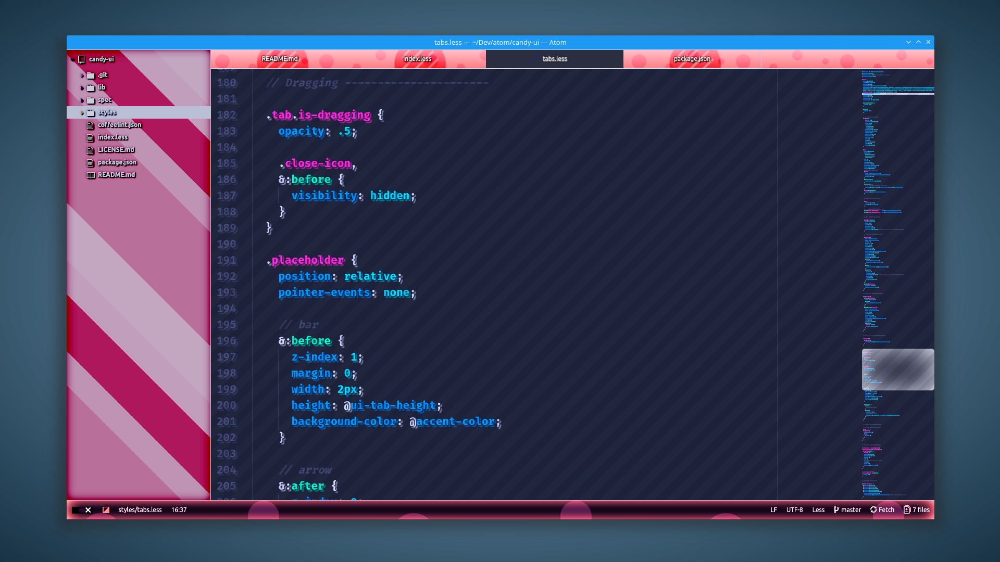
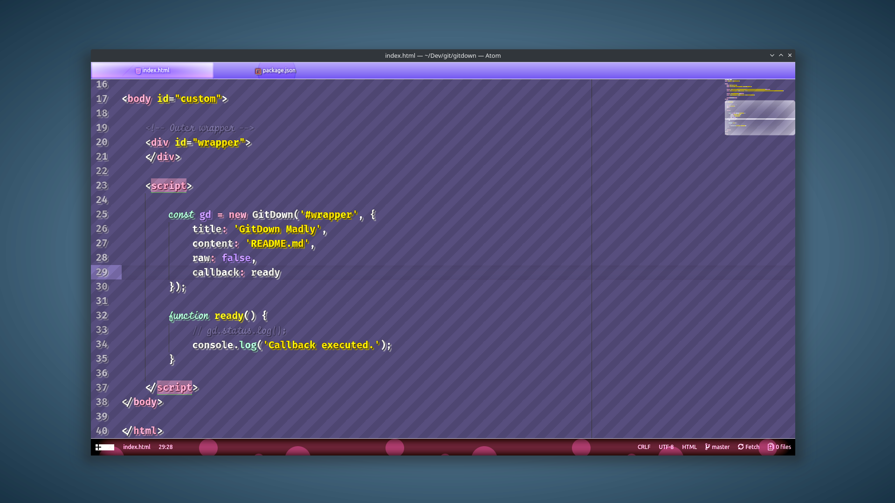
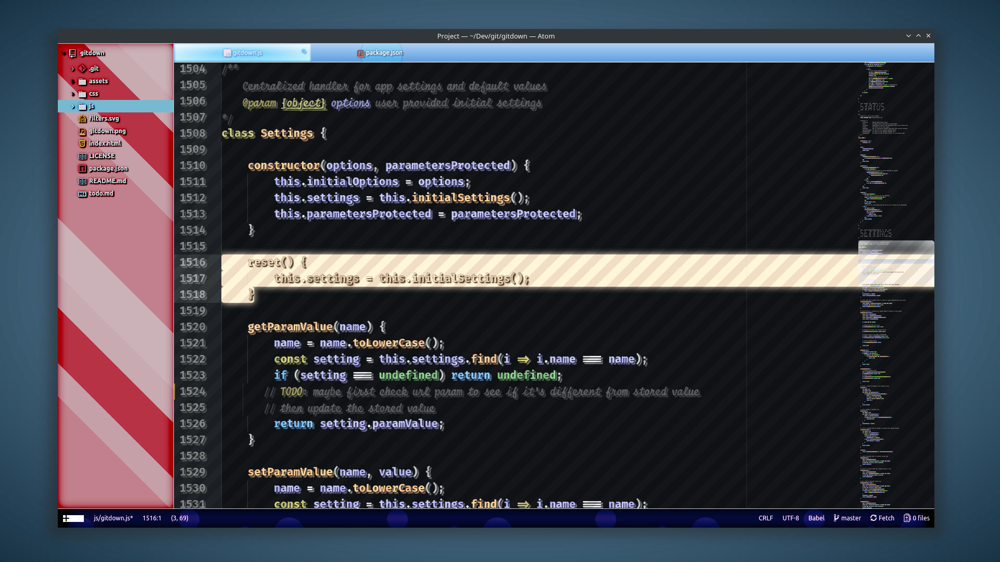
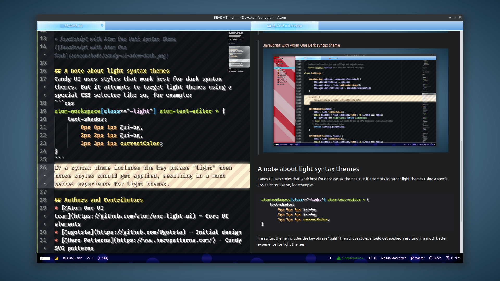

# Candy UI

Lots of candy colors packed in a UI for Atom. Candy UI adds bubble gum, chocolate pink, red, yellow and slime mold green flavors to Atom. It works with most syntax themes but tastes extra good with themes like [Cotton Candy](https://atom.io/themes/cotton-candy) and [Styri](https://atom.io/themes/styri-syntax).

High sugar content ensures coders get lots of energy while burning out real good so they get a solid night's sleep. Add coffee for increased effect.

> CSS  with [Styri](https://atom.io/themes/styri-syntax) syntax theme


>  HTML with [Cotton Candy](https://atom.io/themes/cotton-candy)


> JavaScript with Atom One Dark syntax theme


> Markdown with [MsMeeves Ice Cream Candy](https://atom.io/themes/msmeeves-ice-cream-candy-syntax) syntax theme


## A note about light syntax themes
Candy UI uses styles that work best for dark syntax themes. But it attempts to target light themes using a special CSS selector like so, for example:
```css
atom-workspace[class*="-light"] atom-text-editor * {
    text-shadow:
        0px 0px 1px @ui-bg,
        2px 2px 1px @ui-bg,
        3px 3px 1px currentColor;
}
```
If a syntax theme includes the key phrase "light" then those styles should get applied, resulting in a much better experience for light themes.

## Authors and Contributors
* [@Atom One UI team](https://github.com/atom/one-light-ui) - Core UI elements
* [@ugotsta](https://github.com/Ugotsta) - Initial design
* [@Hero Patterns](https://www.heropatterns.com/) - Candy SVG patterns

KNOWN BUGS
* Very distracting design.
* Blistering array of vivid colors.
* Causes desaturation effect on selections, weird.
* Crazy CSS effects that can't be ported to VS code. Wat?
