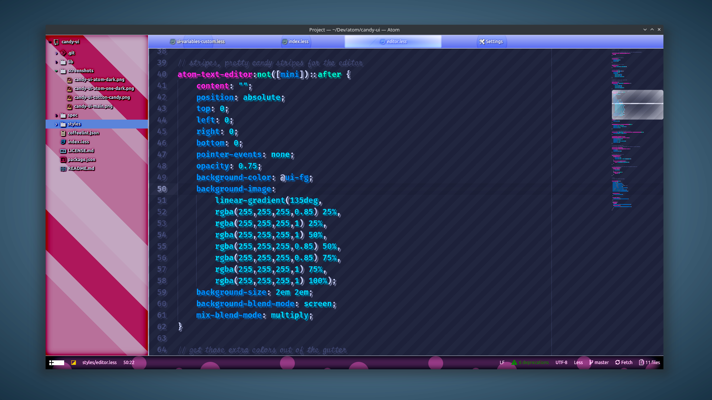

# Candy UI

Lots of candy colors packed in a UI for Atom. Candy UI adds bubble gum, chocolate pink, red, yellow and slime mold green flavors to Atom. It works with most syntax themes but tastes extra good with themes like [Cotton Candy](https://atom.io/themes/cotton-candy) and [Styri](https://atom.io/themes/styri-syntax).

High sugar content ensures coders get lots of energy while burning out real good so they get a solid night's sleep. Add coffee for increased effect.

Candy UI with Styri syntax theme

KNOWN BUGS
* Very distracting design.
* Blistering array of vivid colors.
* Causes desaturation effect on selections, weird.
